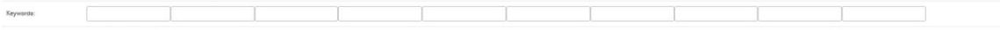

ArrayField
==========

Basic Usage
-----------

To use the ArrayField::

    from django.db import models
    from django_postgres_extensions.models.fields import ArrayField
    class Product(models.Model):
        tags = ArrayField(models.CharField(max_length=15), null=True, blank=True)
        moretags = ArrayField(models.CharField(max_length=15), null=True, blank=True)

Array Indexes
-------------

- Get array values by index::

    from django_postgres_extensions.models.expressions import Index, SliceArray
    obj = Product.objects.annotate(Index('tags', 1)).get()
    print(obj.tags__1)
    obj = Product.objects.annotate(tag_1=Index('tags', 1)).get()
    print(obj.tag_1)
    obj = Product.objects.annotate(SliceArray('tags', 0, 1)).get()
    print(obj.tags__0_1)

- Update array values by index::

    Product.objects.update(tags__2='Heavy Metal')

Database Functions
------------------

Various database functions are included for manipulating arrays:

- ArrayLength: returns the length of an array

- ArrayPosition: the position of an item in an array

- ArrayPositions: all positions of an item in an array

- ArrayAppend: Create an array value by adding a value to the end of an array field

- ArrayPrepend: Create an array value by adding a value to the start of an array field

- ArrayRemove: Create an array value by removing a value from an array field

- ArrayReplace: Create an array value by replacing one value with another in an array field

- ArrayCat: Combine the values of two separate ArrayFields

For more information on each of these functions, check the postgresql documentation.
The provided arguments to each function are automatically converted to the required expressions::

    from django_postgres_extensions.models.functions import *
    obj = Product.objects.queryset.annotate(tags_length=ArrayLength('tags', 1)).get()
    obj = Product.objects.annotate(position=ArrayPosition('tags', 'Rock')).get()
    obj = Product.objects.annotate(positions=ArrayPositions('tags', 'Rock')).get()
    Product.objects.update(tags = ArrayAppend('tags', 'Popular'))
    Product.objects.update(tags = ArrayPrepend('Popular', 'tags'))
    Product.objects.update(tags = ArrayRemove('tags', 'Album'))
    Product.objects.update(tags = ArrayReplace('tags', 'Rock', 'Heavy Metal'))
    Product.objects.update(tags = ArrayCat('tags', 'moretags'))
    Product.objects.update(tags=ArrayCat('tags', ['Popular', '8'], output_field=Product._meta.get_field('tags')))

Use in ModelForms
-----------------

django.contrib.postgres includes two possible array form fields: SimpleArrayField (the default) and SplitArrayField.
To use the SplitArrayField automatically when generating a ModelForm, add the form_size keyword argument to the ArrayField::

    class Product(models.Model):
        keywords = ArrayField(models.CharField(max_length=20), default=[], form_size=10, blank=True)

The field would look like:

Alternatively, it is possible to use a Multiple Choice Field for an Array, by specifying a choices argument::

    sports = ArrayField(models.CharField(max_length=20),default=[], blank=True, choices=(
    ('football', 'Football'), ('tennis', 'Tennis'), ('golf', 'Golf'), ('basketball', 'Basketball'), ('hurling', 'Hurling'), ('baseball', 'Baseball')))

The field would look like:

Array Lookups
-------------

Additional lookups have been added to the ArrayField to enable queries using the ANY and ALL database functions::

    qs = Product.objects.filter(tags__any = 'Popular')
    qs = Product.objects.filter(tags_all__isstartof = 'Popular')

Any lookups check if any value in the array meets the lookup criteria.
All lookups check is all values in an array meet the lookup criteria.
The full list of additional lookups are:

- any
- any_exact
- any_gt
- any_gte
- any_lt
- any_lte
- any_in
- any_isstartof
- any_isendof
- any_contains (for 2d arrays)
- all
- all_exact
- all_gt
- all_gte
- all_lt
- all_lte
- all_in
- all_isstartof
- all_isendof
- all_regex