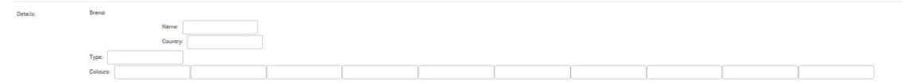

JSONField
=========

Basic Usage
-----------

To use the JSON field::

    from django.db import models
    from django_postgres_extensions.models.fields import JSONField

    class Product(models.Model):
        description = JSONField(null=True, blank=True)

Individual keys
---------------

- Get json values by key or key path::

    from django_postgres_extensions.models.expressions import Key
    obj = Product.objectsannotate(Key('description', 'Details')).get()
    obj = Product.objects.annotate(Key('description', 'Details__Rating')).get()
    obj = Product.objects.annotate(Key('description', 'Tags__1')).get()

- Update JSON Field by specific keys, leaving any others untouched::

    Product.objects.update(description__ = {'Industry': 'Movie', 'Popularity': 'Very Popular'})

- Delete JSONField by key or key path::

    Product.objects.update(description__del ='Details')
    Product.objects.update(description__del = 'Details__Release')
    Product.objects.update(description__del='Tags__1')

Database functions
------------------

Various database functions are included for interacting with JSONFields:

- JSONBSet: updates individual keys in the JSONField without modifying the others.

- JSONBArrayLength: returns the length of a JSONField who's parent object is an array.

Check the postgresql documentation for more information on these functions.
These functions handle the arguments by converting them to the correct expressions automatically::

    from django_postgres_extensions.models.functions import *
    from psycopg2.extras import Json
    obj = Product.objects.update(description = JSONBSet('description', ['Details', 'Genre'], Json('Heavy Metal'), True))
    obj = Product.objects.update(description = JSONBSet('description', ['1', 'c'], Json('g')))
    obj = Product.objects.queryset.annotate(tags_length=JSONBArrayLength('tags', 1)).get()

Use With NestedFormField
------------------------

The same NestedFormField and NestedFormWidget referred in the HStore description can also be used with a JSON Field.
To use it give the fields keyword argument::

    details_fields = (
        NestedFormField(label='Brand', keys=('Name', 'Country')),
        forms.CharField(label='Type', max_length=25, required=False),
        SplitArrayField(label='Colours', base_field=forms.CharField(max_length=10, required=False), size=10),
    )

    class Product(models.Model):
       details = JSONField(fields=details_fields, blank=True, default={})

The field would look like:

