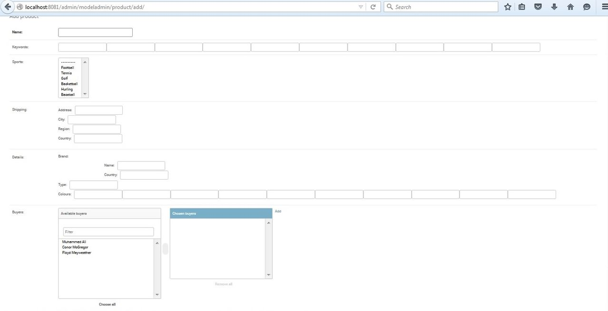
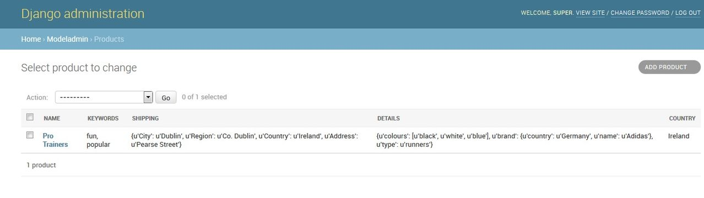

Django Postgres Extensions!
===========================

Django Postgres Extensions adds a lot of functionality to Django.contrib.postgres, specifically in relation to ArrayField, HStoreField and JSONField, including much better form fields for dealing with these field types. The app also includes an Array Many To Many Field, so you can store the relationship in an array column instead of requiring an extra database table.

Check out http://django-postgres-extensions.readthedocs.io/en/latest/ to get started.

Feature Overview
================
Custom Postgres backend
-----------------------
The customized Postgres backend adds the following features:

- HStore Extension is automatically activated when a test database is created so you don't need to create a separate migration which is useful especially when building re-usable apps
- Uses a different update compiler which adds some functionality outlined in the ArrayField section below
- If db_index is set to True for an ArrayField, a GIN index will be created which is more useful than the default database index for arrays.
- Adds some extra operators to enable ANY and ALL lookups

ArrayField
----------
The included ArrayField has been subclassed from django.contrib.postgres.fields.ArrayField to add extra features and is a drop-in replacement. To use this ArrayField. The customized Postgres ArrayField adds the following features:

- Get array values by index:
- Update array values by index:
- Added database functions for interacting with Arrays. These functions handle the provided arguments by automatically converting them to the required expressions.
- Add an array of values to an existing field. In this case the output_field is required to tell Django what db type to use for the array:
- Additional lookups have been added to the ArrayField to enable queries using the ANY and ALL database functions.
- Use either a split array field or a multiple choice field in a model form

HStoreField
-----------
The included HStoreField has been subclassed from django.contrib.postgres.fields.HStoreField to add extra features and is a drop-in replacement. To use this HStoreField:

The customized Postgres HStoreField adds the following features:

- Get hstore values by key
- Update hstore by specific keys, leaving any others untouched
- Added database functions for interacting with HStores, these functions handle the arguments by converting them to the correct expressions automatically.
- Nested form field for a better representation of hstore in a form, either by providing a list of keys or list of form fields.

JSONField
---------
The included JSONField has been subclassed from django.contrib.postgres.fields.JSONField to add extra features and is a drop-in replacement. To use this JSONField:

The customized Postgres JSONField adds the following features:

- Get json values by key or key path
- Update JSON Field by specific keys, leaving any others untouched
- Delete JSONField by key or key path
- Extra database functions for interacting with JSONFields. These functions handle the arguments by converting them to the correct expressions automatically.
- The same NestedFormField and NestedFormWidget referred to above for HStore can also be used with a JSON Field by providing a list of fields.

ModelAdmin
----------

For an example of how these fields can be configured in a modelform; take the following models.py::

   from django.db import models
   from django_postgres_extensions.models.fields import HStoreField, JSONField, ArrayField
   from django_postgres_extensions.models.fields.related import ArrayManyToManyField
   from django import forms
   from django.contrib.postgres.forms import SplitArrayField
   from django_postgres_extensions.forms.fields import NestedFormField

   details_fields = (
       ('Brand', NestedFormField(keys=('Name', 'Country'))),
        ('Type', forms.CharField(max_length=25, required=False)),
        ('Colours', SplitArrayField(base_field=forms.CharField(max_length=10, required=False), size=10)),
   )

   class Buyer(models.Model):
       time = models.DateTimeField(auto_now_add=True)
       name = models.CharField(max_length=20)

       def __str__(self):
           return self.name

   class Product(models.Model):
       name = models.CharField(max_length=15)
       keywords = ArrayField(models.CharField(max_length=20), default=[], form_size=10, blank=True)
       sports = ArrayField(models.CharField(max_length=20),default=[], blank=True, choices=(
       ('football', 'Football'), ('tennis', 'Tennis'), ('golf', 'Golf'), ('basketball', 'Basketball'), ('hurling', 'Hurling'), ('baseball', 'Baseball')))
       shipping = HStoreField(keys=('Address', 'City', 'Region', 'Country'), blank=True, default={})
       details = JSONField(fields=details_fields, blank=True, default={})
       buyers =  ArrayManyToManyField(Buyer)

       def __str__(self):
           return self.name

       @property
       def country(self):
           return self.shipping.get('Country', '')

And with admin.py::

   from django.contrib import admin
   from django_postgres_extensions.admin.options import PostgresAdmin
   from models import Product, Buyer

   class ProductAdmin(PostgresAdmin):
       filter_horizontal = ('buyers',)
       fields = ('name', 'keywords', 'sports', 'shipping', 'details', 'buyers')
       list_display = ('name', 'keywords', 'shipping', 'details', 'country')

   admin.site.register(Buyer)
   admin.site.register(Product, ProductAdmin)

The form field would look like this:

The list display would look like this:

Additional Queryset Methods
---------------------------
The app adds the format method to all querysets. This will defer a field and add an annotation with a different format.
For example to return a hstorefield as json::

   qs = Model.objects.all().format('description', HstoreToJSONBLoose)

Array Many To Many Field
------------------------
The Array Many To Many Field is designed be a drop-in replacement of the normal Django Many To Many Field and thus replicates many of its features.

The Array Many To Many field supports the following features which replicate the API of the regular Many To Many Field:

- Descriptor queryset with add, remove, clear and set for both forward and reverse relationships
- Prefetch related for both forward and reverse relationships
- Lookups across relationships with filter for both forward and reverse relationships
- Lookups across relationships with exclude for forward relationships only
